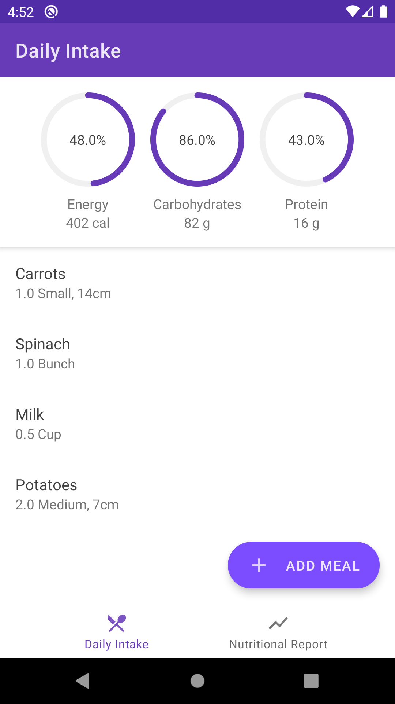
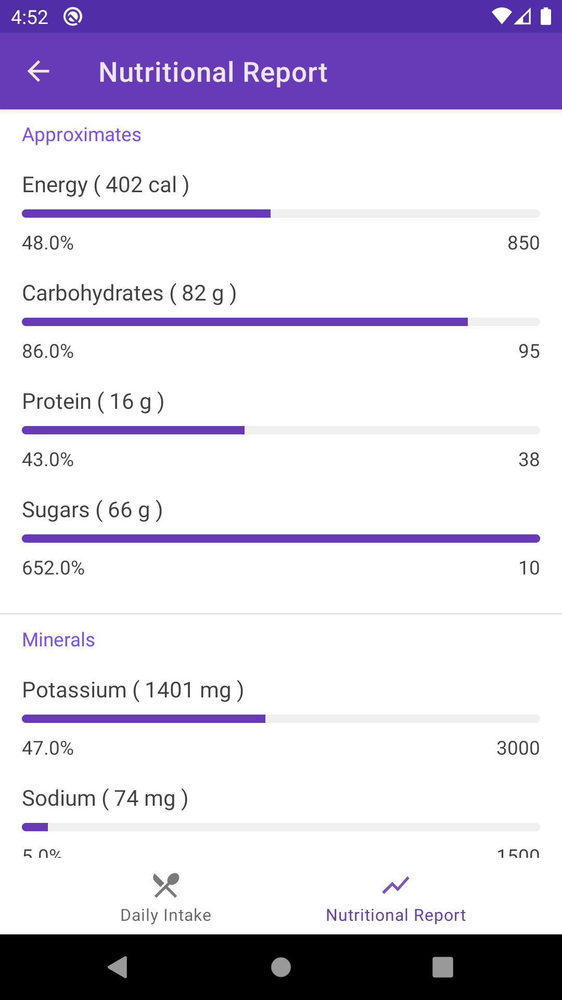

# Ambrosia

A food calculator app with a beautiful material design interface.

Written in Kotlin, with MVVM architecture and data binding.

Works offline with a Room database.

# Instructions to test

And [app-debug.apk](app-debug.apk) is included for testing.

# Screenshots

